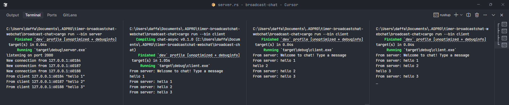

## Broadcast Chat

### How to Run

1.  **Start the Server:**
    Open your terminal and navigate to the project directory. Run the following command:

    ```bash
    cargo run --bin server
    ```

    The server will start and listen for incoming client connections on `127.0.0.1:8080`.

2.  **Start the Clients:**
    Open new terminal windows for each client you want to run. Navigate to the project directory in each terminal and run:
    ```bash
    cargo run --bin client
    ```
    You can run this command multiple times to simulate multiple clients. Each client will connect to the server.

### Client Interaction

Once the server is running and you have started a few clients (e.g., three clients as suggested), you can type messages into any of the client terminals.



**What happens:**
When you type a message in one client and press Enter, that message is sent to the server. The server then broadcasts this message to all other connected clients. This means every client (except the one that sent the message initially) will display the message in its terminal. This demonstrates the "broadcast" nature of the chat application.
