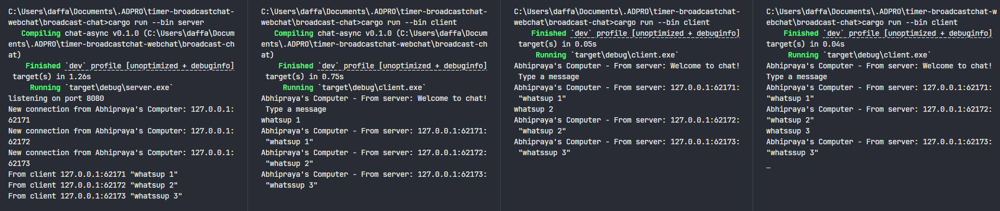

## Broadcast Chat

### How to Run

1.  **Start the Server:**
    Open a terminal and navigate to the project directory. Run the following command:

    ```bash
    cargo run --bin server
    ```

    The server will start and listen for incoming client connections on `127.0.0.1:8080`.

2.  **Start the Clients:**
    Open new terminal windows for each client we want to run. Navigate to the project directory in each terminal and run:
    ```bash
    cargo run --bin client
    ```
    We can run this command multiple times to simulate multiple clients. Each client will connect to the server.

### Client Interaction

Once the server is running and we have started a few clients (e.g., three clients as suggested), we can type messages into any of the client terminals.


**What happens:**
When we type a message in one client and press Enter, that message is sent to the server. The server then broadcasts this message to all other connected clients. This means every client (except the one that sent the message initially) will display the message in its terminal. This demonstrates the "broadcast" nature of the chat application.

### Modifying the WebSocket Port

The application uses a WebSocket connection for communication between the server and clients. The default port in the original code is `2000`.

To change the port to `8080`, we need to modify the following files:

1.  **`src/bin/server.rs`**:

    - Update the `TcpListener::bind` address to `"127.0.0.1:8080"`.
    - Optionally, update the `println!` message to reflect the new port `8080`.

    ```rust
    // ... inside main fn ...
    let listener = TcpListener::bind("127.0.0.1:8080").await?;
    println!("listening on port 8080");
    // ... rest of the code ...
    ```

2.  **`src/bin/client.rs`**:

    - Update the URI in `ClientBuilder::from_uri` to `"ws://127.0.0.1:8080"`.

    ```rust
    // ... inside main fn ...
    let (mut ws_stream, _) =
        ClientBuilder::from_uri(Uri::from_static("ws://127.0.0.1:8080"))
            .connect()
            .await?;
    // ... rest of the code ...
    ```

The WebSocket protocol (`ws://`) is explicitly defined in the client-side code (`src/bin/client.rs`) when constructing the URI for the connection. The server side, while not explicitly stating `ws://` in the `TcpListener::bind` function, handles the WebSocket handshake and subsequent communication once a TCP connection is established on the specified port. Both sides need to agree on the same port number for the connection to be successful.

After making these changes, we can run the server and clients as described previously, and they will now communicate over port `8080`.


If we only change the port on one side, either the client or the server, the connection will fail because they will be trying to communicate on different ports. Both the client and server must use the same port number for the WebSocket connection to work properly.

### Adding Sender Information to Messages



To better understand how messages are passed and to identify the sender, I modified the server to include the sender's IP address and port with each message, and also customized some log messages.

**Changes Made:**

1.  **In `src/bin/server.rs`:**

    - **Connection Logging:** When a new client connects, the server now logs this with a custom message:
      ```rust
      // In main loop
      println!("New connection from Abhipraya's Computer: {addr:?}");
      ```
    - **Message Broadcasting:** Within the `handle_connection` function, when the server receives a message, it formats it to include the client's `SocketAddr` (using debug formatting for both address and text) before broadcasting:
      ```rust
      // In handle_connection loop
      if let Some(text) = msg.as_text() {
          println!("From client {addr:?} {text:?}"); // Server still logs the original message and sender
          // Broadcast message now includes sender's address and text with debug formatting
          bcast_tx.send(format!("{addr:?}: {text:?}"))?;
      }
      ```

2.  **In `src/bin/client.rs`:**
    - **Displaying Messages:** When a client receives a message from the server, it prepends "Abhipraya's Computer - From server:" to the displayed message:
      ```rust
      // In main loop, when handling incoming messages
      if let Some(text) = msg.as_text() {
          println!("Abhipraya's Computer - From server: {}", text);
      }
      ```

**Why these changes are made:**

The server is the central point that receives all messages. By modifying it to include `addr:?` (the debug representation of the sender's `SocketAddr`) and `text:?` (the debug representation of the message text) in the `format!` macro, we ensure that the sender's full address details and the exact text (including any special characters if they were not handled by `as_text()`) are broadcast. The server-side log for new connections was customized for clarity.

The client-side change to prepend "Abhipraya's Computer - From server:" helps in identifying the source of the message clearly on the client's console, attributing it to the server acting on behalf of "Abhipraya's Computer" (which in this context seems to be a label for the messages originating from or processed by your setup).
